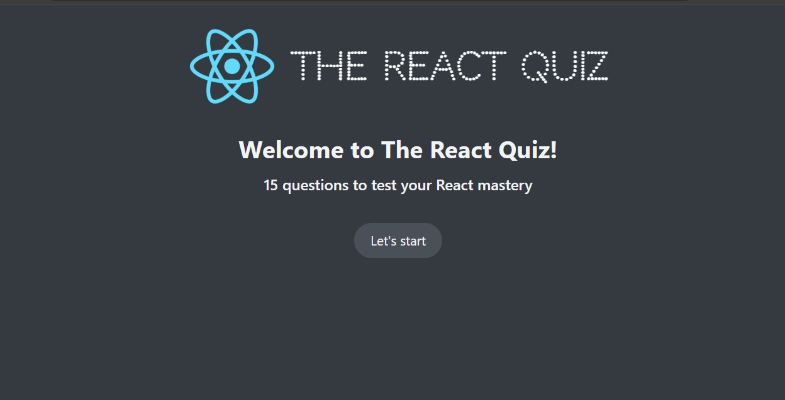
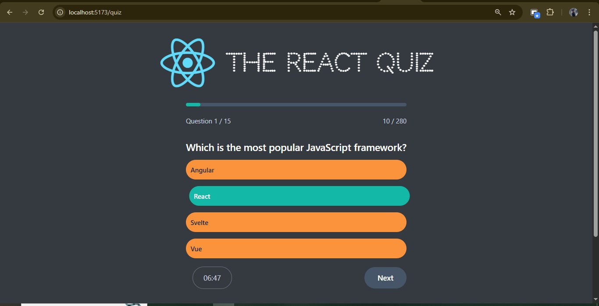
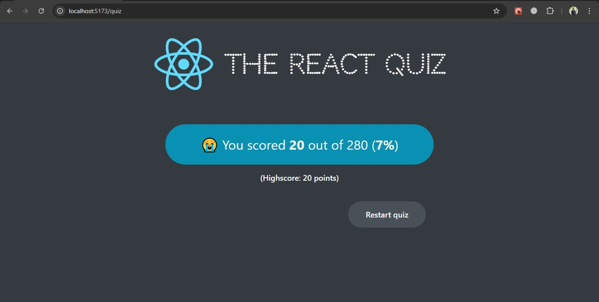

# 🧠 React Quiz App

A modern, interactive quiz application built with **React**, **Tailwind CSS**, and **Context API**.  
The app includes multiple-choice questions, a progress bar, a timer, and a result screen with a saved high score.

---

## ✨ Features

- 📚 **Multiple-choice questions** with instant feedback.
- 🕒 **Countdown timer** — quiz automatically ends when time is up.
- 📊 **Progress bar** to track quiz completion.
- 🏆 **High score tracking** using localStorage.
- 🔄 **Restart quiz** option at the end.
- 🎨 **Responsive design** with Tailwind CSS.
- ⚡ **State management** with React Context API + useReducer.
- ✅ **Clean UI** and smooth animations.

---

## 📸 Screenshots

### Start Screen


### Quiz Screen


### Result Screen


---

## 🚀 Live Demo
[🔗 Click here to view live demo](https://your-live-demo-link.com)  
*(Replace with your deployed link)*

---

## 🛠️ Tech Stack

- **Frontend:** React, Tailwind CSS
- **State Management:** React Context API + useReducer
- **Routing:** React Router
- **Build Tool:** Vite

---

## 📂 Project Structure

```bash
src/
│
├── components/
│   ├── Navbar.jsx
│   ├── Result.jsx
│   ├── Timer.jsx
│
├── context/
│   ├── AppContext.jsx
│
├── data/
│   ├── data.js
│
├── pages/
│   ├── Layout.jsx
│   ├── StartScreen.jsx
│   ├── QuizScreen.jsx
│   ├── ResultScreen.jsx
│
├── App.jsx
└── main.jsx
